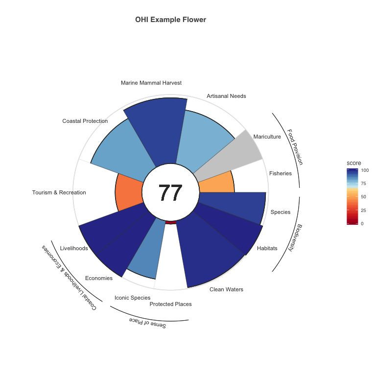

<!-- README.md is generated from README.Rmd. Please edit that file -->

# flowers

<!-- badges: start -->

[](https://CRAN.R-project.org/package=flowers)
[](https://www.repostatus.org/#wip)
<!-- badges: end -->

Flowers is a package for generating flower plots. It was derived from
code from Jim Regetz at NCEAS, and then rewritten and extended by the
OHI project. This package formalizes the approach into an easily
re-usable function for generating custom flower plots for multiple
scenarios.

## Quick Start

This is a basic example which shows you how to create a flower plot from
an appropriately structured data set:

``` r
library(flowers)
data(ohi)
plot_flower(ohi, "OHI Example Flower")
```



Currently `plot_flower()` expects particular column names and semantics,
but this could be made more flexible. See the structure of OHI for an
example.

    #> 'data.frame':    13 obs. of  6 variables:
    #>  $ goal       : chr  "FIS" "MAR" "AO" "NP" ...
    #>  $ score      : num  50.5 NA 79.3 95.2 81.9 ...
    #>  $ order      : num  1.1 1.2 2 3 5 6 7.1 7.2 8.1 8.2 ...
    #>  $ weight     : num  0.5 0.5 1 1 1 1 0.5 0.5 0.5 0.5 ...
    #>  $ name_supra : chr  "Food Provision" "Food Provision" NA NA ...
    #>  $ name_flower: chr  "Fisheries" "Mariculture" "Artisanal Needs" "Marine Mammal Harvest" ...

## Installation

You can install the development version of flowers from
[GitHub](https://github.com/mbjones/flowers) with:

``` r
devtools::install_github("mbjones/flowers")
```

You can install the released version of flowers from
[CRAN](https://CRAN.R-project.org) with:

``` r
install.packages("flowers")
```
